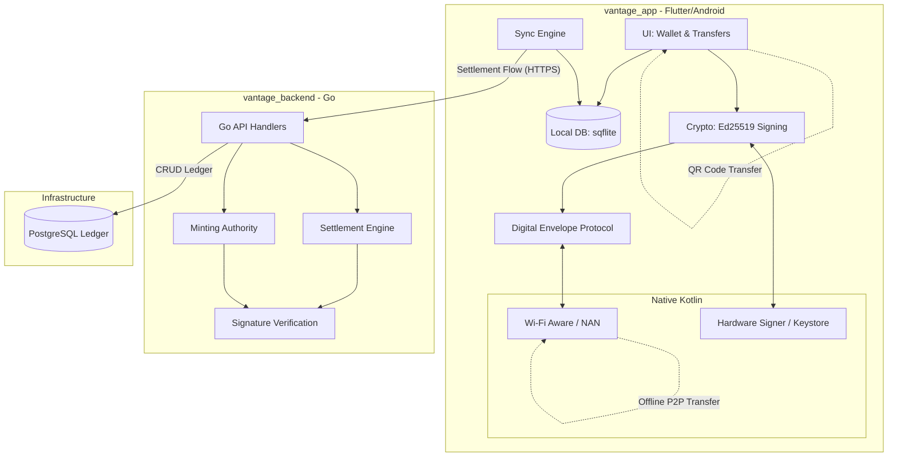

# Project Vantage

Project Vantage is a highly secure, **offline-first digital payment system** designed for peer-to-peer (P2P) transactions in environments with limited or no internet connectivity. It utilizes cryptographic "Digital Vouchers" and "Envelopes" to ensure trust and prevent double-spending without requiring a real-time connection to a central ledger.

## 🚀 Key Features

- **Offline-First P2P Transfers**: Exchange value directly between devices using Wi-Fi Aware (NAN) and QR codes.
- **Cryptographic Security**: Uses **Ed25519** digital signatures (Edwards-curve Digital Signature Algorithm) for non-repudiation and integrity.
- **Digital Envelopes**: A secure transport mechanism that wraps vouchers with sender and receiver identities to ensure safe handover.
- **Hardware-Backed Security**: Designed to leverage Android's Hardware Keystore for secure key management and signing.
- **Asynchronous Settlement**: Transactions are recorded offline and settled with the central backend once a device regains connectivity.
- **Double-Spending Prevention**: The backend serves as the ultimate source of truth, validating the chain of ownership for every voucher during settlement.

## 🏗️ Architecture



## 🏗️ Project Structure

The project is split into two main components:

### 1. [vantage_app](./vantage_app/) (Flutter Mobile App)
- **Core Models**: Implements `Voucher` and `Envelope` primitives.
- **Cryptography**: Ed25519 implementation via the `cryptography` package.
- **P2P Discovery**: Native Android implementation for Wi-Fi Aware (NAN) discovery and high-speed offline data paths.
- **Sync Engine**: Manages the queue of offline signatures and handles background synchronization.

### 2. [vantage_backend](./vantage_backend/) (Go API)
- **Minting Authority**: Issues new signed vouchers to users.
- **Settlement Engine**: Processes received digital envelopes, verifies cryptographic signatures, and updates the global ledger.
- **Internal Logic**: Implements idempotency and double-spending checks.
- **Database**: PostgreSQL for persistent storage of transactions and voucher states.

## 🛠️ Technology Stack

- **Frontend**: [Flutter](https://flutter.dev), Dart.
- **Native (Android)**: Kotlin (Wi-Fi Aware, Hardware Signer).
- **Backend**: [Go (Golang)](https://golang.org).
- **Database**: [PostgreSQL](https://www.postgresql.org).
- **Security**: Ed25519 Signatures.

## 🚦 Getting Started

### Prerequisites
- Flutter SDK (3.x+)
- Go (1.21+)
- PostgreSQL (15+)
- Android device with Wi-Fi Aware support (for P2P features)

### Installation

1.  **Clone the repository**:
    ```bash
    git clone https://github.com/your-repo/vantage.git
    cd vantage
    ```

2.  **Set up the Backend**:
    - Navigate to `vantage_backend`.
    - Configure your `.env` file (refer to `schema.sql` for DB setup).
    - Run the server: `go run cmd/api/main.go`.

3.  **Set up the App**:
    - Navigate to `vantage_app`.
    - Install dependencies: `flutter pub get`.
    - Run the app: `flutter run`.

## 🛡️ Security Architecture

1.  **Voucher Generation**: The backend "mints" a voucher by signing a payload (Amount, UUID, Expiration) with the system's private key.
2.  **P2P Transfer**: When User A pays User B, they wrap the voucher in an `Envelope`. User A signs the envelope, effectively "handing over" the credit to User B's public key.
3.  **Settlement**: User B (the receiver) syncs the envelope to the backend. The backend verifies both the original issuer's signature and the sender's signature before clearing the transaction.

## 🗺️ Roadmap

- [ ] Complete UI/UX implementation in Flutter.
- [ ] Implement local persistence (sqflite) for offline wallet storage.
- [ ] Finalize Native Wi-Fi Aware data path implementation.
- [ ] Implement full double-spending verification logic in the Go backend.

---
*Project Vantage — Secure Offline Payments for Everyone.*
